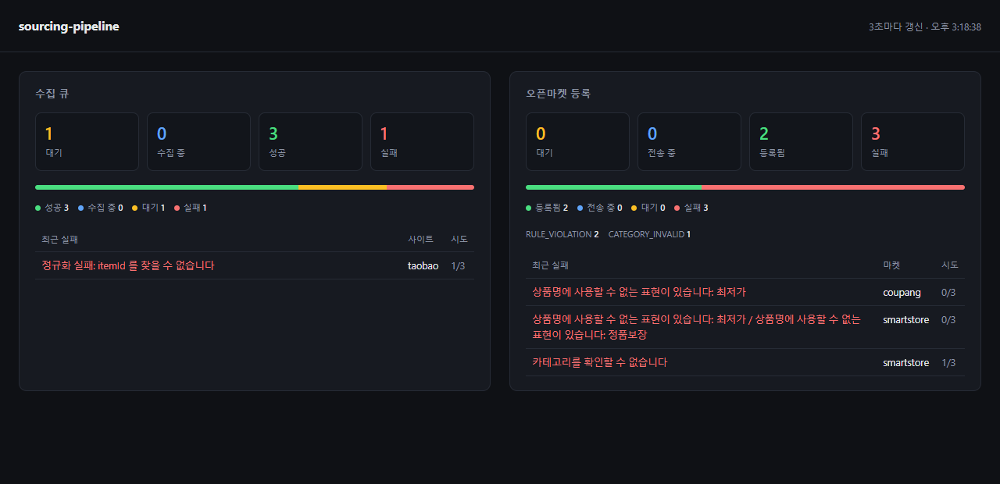

# sourcing-pipeline

해외 쇼핑몰 상품을 **수집 → 정규화 → 오픈마켓 연동**까지 흘려보내는 파이프라인.

커머스 상품 소싱 시스템을 5년간 운영하며 반복해서 부딪힌 문제들 — 수집이 조용히 실패하는 것,
같은 상품이 중복 등록되는 것, 브라우저 탭이 죽어 큐가 멈추는 것 — 을 처음부터 다시 설계한 개인 프로젝트다.

> 수집(1단계)과 오픈마켓 등록(2단계)이 서버만으로 끝까지 동작한다. [로드맵](#로드맵) 참고.

## 무엇을 푸는가

상품 상세 페이지는 로그인·봇 차단·동적 렌더링 때문에 서버에서 직접 긁기 어렵다.
그래서 **실제 브라우저(크롬 확장)가 수집을 수행하고, 서버는 큐와 정규화를 맡는다.**
이 구조에서 진짜 어려운 부분은 크롤링이 아니라 **신뢰성**이다.

| 문제 | 이 프로젝트의 답 |
|---|---|
| 탭이 죽으면 작업이 영원히 진행중으로 남는다 | lease 기반 점유 + 만료분 자동 회수 |
| 대상 사이트에 부하를 주면 차단당한다 | 서버가 동시 실행 수를 통제(확장이 아니라 서버가 결정) |
| 같은 상품이 중복 등록된다 | (사이트, 상품ID) 유니크 + upsert 로 재수집 멱등 |
| 일시적 실패와 영구적 실패가 섞인다 | 네트워크 실패는 지수 백오프 재시도, 구조 오류는 즉시 확정 실패 |
| 정규화 규칙을 고치면 과거 수집분을 못 살린다 | 원본 페이로드를 그대로 보존해 재처리 가능 |
| 사이트마다 데이터 구조가 다르다 | `SiteAdapter` 구현체 추가만으로 신규 사이트 지원 |
| 마켓 규칙을 어긴 상품이 재시도만 반복한다 | 보내기 전에 마켓 규칙으로 걸러 확정 실패로 끝낸다 |
| 같은 상품이 마켓에 두 번 올라간다 | 페이로드 해시가 같으면 전송 자체를 하지 않는다 |
| 마켓이 성공을 주는데 상품이 없다 | 마켓 상품ID 가 비면 성공으로 기록하지 않는다 |

## 구조

```
┌──────────────────┐   ① claim         ┌─────────────────────────┐
│  크롬 확장 (MV3) │ ◀───────────────  │   Spring Boot 서버      │
│                  │                   │                         │
│  background.js   │   ② 탭 열고 추출  │  CollectJob (상태기계)  │
│  extractor.js    │ ─────────────▶    │  ├ lease/동시성 제어    │
│                  │   ③ result        │  ├ 지수 백오프 재시도   │
│  popup (현황)    │ ─────────────▶    │  └ 만료 lease 회수      │
└──────────────────┘                   │                         │
                                       │  SiteAdapter (정규화)   │
                                       │  ├ TaobaoAdapter        │
                                       │  └ GenericAdapter       │
                                       │        ↓                │
                                       │  Product / ProductOption│
                                       │  RawProduct (원본 보존) │
                                       │        ↓                │
                                       │  MarketListing (등록 큐)│
                                       │  ├ 규칙 선검사          │
                                       │  ├ 판매가 계산          │
                                       │  └ 실패 분류/재전송     │
                                       │        ↓                │
                                       │  MarketAdapter          │
                                       │  ├ SmartStoreAdapter    │──▶ 오픈마켓
                                       │  └ CoupangAdapter       │
                                       └─────────────────────────┘
```

작업 상태 전이:

```
PENDING ──claim──▶ RUNNING ──성공──▶ SUCCEEDED
   ▲                  │
   │                  ├── 일시 실패(시도 < 상한) ──▶ 백오프 후 PENDING
   └──────────────────┤
                      ├── 일시 실패(시도 = 상한) ──▶ FAILED
                      ├── 구조 오류(정규화 실패) ──▶ FAILED (재시도 안 함)
                      └── lease 만료(워커 사망) ──▶ 회수 후 PENDING
```

등록 상태 전이:

```
QUEUED ──begin──▶ SENDING ──마켓 수용──▶ LISTED
   ▲                 │
   │                 ├── 일시 실패(혼잡·네트워크) ──▶ 백오프 후 QUEUED
   │                 ├── 규칙 위반/상품ID 없음 ────▶ FAILED (재시도 안 함)
   └─────────────────┴── 응답 없음(전송 타임아웃) ─▶ 회수 후 QUEUED
```

## 설계에서 신경 쓴 것

**동시성 상한은 서버가 가진다.**
확장에서 세면 창을 두 개 띄우는 순간 상한이 무너진다. 서버가 `RUNNING` 개수를 보고
`claim` 에 204를 돌려주면 확장은 대기한다. 확장은 자기가 몇 개를 돌리는지 알 필요가 없다.

**실패를 예외로 흘리지 않는다.**
초기 구현은 정규화 실패 시 예외를 던졌는데, 같은 트랜잭션에서 기록한 `FAILED` 상태가
함께 롤백되어 작업이 `RUNNING` 으로 남고 동시 실행 슬롯을 영구 점유했다.
지금은 `SubmitOutcome.Rejected` 반환값으로 바꿔 상태가 반드시 커밋되게 했다.
([관련 커밋](../../commit/0fcd47b) · 이 결함을 잡는 회귀 테스트는 일부러 `@Transactional` 없이 작성했다)

**원본을 버리지 않는다.**
`RawProduct` 에 수집 원본을 그대로 남긴다. 정규화 규칙이 바뀌어도 과거 수집분을 다시 돌릴 수 있고,
"왜 이 값이 이렇게 들어왔는가"를 사후에 추적할 수 있다.

**신규 사이트 추가에 기존 코드를 건드리지 않는다.**
`SiteAdapter` 구현체를 하나 추가하면 `AdapterRegistry` 가 자동으로 등록한다.

**실패할 걸 아는 요청은 보내지 않는다.**
마켓마다 상품명 길이·옵션 수·금지 표현·최소 판매가가 다르다. 보내고 나서 거절당하면
(1) 마켓 API 를 한 번 쓴 뒤고, (2) 거절 사유가 마켓 문구 그대로라 사용자에게 전달되지 않으며,
(3) 재시도 큐에 남아 같은 실패를 상한까지 반복한다.
그래서 어댑터가 `MarketRules` 로 조건을 선언하고, 전송 전에 **위반 사유를 한꺼번에** 모아 확정 실패로 끝낸다.
하나씩 알려주면 고쳐 보낼 때마다 다른 사유로 다시 막힌다.

**"성공했다"는 응답을 그대로 믿지 않는다.**
마켓이 200 을 주면서 상품ID 를 비워 보내는 경우가 있다. 이걸 성공으로 적으면
*등록됐다는데 마켓에는 없는* 건이 조용히 쌓이고, 아무도 다시 보내지 않는다.
마켓 상품ID 가 없으면 성공으로 기록하지 않는다.

**마켓 호출을 DB 트랜잭션 안에 두지 않는다.**
전송은 두 트랜잭션으로 나뉜다. `beginSend` 가 규칙 검사·페이로드 생성·SENDING 기록까지 하고 커밋한 뒤,
트랜잭션 밖에서 마켓을 호출하고, `completeSend` 가 응답을 반영한다.
한 트랜잭션으로 묶으면 마켓이 느려질 때 DB 커넥션이 같이 묶이고, 프로세스가 죽으면
"마켓에는 올라갔는데 우리 쪽엔 흔적이 없는" 상태가 된다. 나눠 두면 SENDING 이 남아 회수할 수 있다.

**같은 내용을 다시 보내지 않는다.**
전송한 페이로드의 해시를 남겨, 재전송 요청이 와도 내용이 그대로면 마켓을 호출하지 않는다.
판단 기준은 상태가 아니라 마켓 상품ID 보유 여부다 — 재전송 요청으로 상태가 QUEUED 로 돌아가도,
이미 올라가 있다는 사실이 없어지는 것은 아니기 때문이다.

**판매가 계산은 한 곳에만 둔다.**
어댑터마다 각자 계산하게 두면 같은 상품이 마켓마다 다른 값으로 올라간다.
`PricingPolicy` 가 환율·마진·절상 단위를 적용해 금액을 정하고, 어댑터는 결과만 받는다.
절사가 아니라 올림인 이유는, 절사하면 실제 마진이 설정값보다 항상 조금 낮아지기 때문이다.

## 실행

필요: JDK 21

```bash
./gradlew bootRun
```

서버를 띄우면 `http://localhost:8080` 이 **현황 화면**으로 이어진다.
수집 큐와 등록 큐의 상태 비율, 실패 사유별 집계, 최근 실패 목록을 3초마다 갱신한다.



실패를 **건수가 아니라 사유별로** 본다. 무엇을 먼저 고쳐야 하는지는 총계가 아니라 사유에서 나온다.
시도 횟수가 `0/3` 인 실패는 마켓에 보내지도 않고 걸러낸 건이다.

동작 확인 (서버만으로 파이프라인 전체를 검증할 수 있다):

```bash
# 1. 수집 요청 등록
curl -X POST http://localhost:8080/api/v1/jobs \
  -H 'Content-Type: application/json' \
  -d '{"siteCode":"taobao","externalId":"888777","sourceUrl":"https://item.taobao.com/item.htm?id=888777"}'

# 2. 워커가 작업을 점유
curl -X POST 'http://localhost:8080/api/v1/jobs/claim?workerId=worker-A'

# 3. 수집 결과 제출 → 정규화 + 저장
curl -X POST http://localhost:8080/api/v1/jobs/1/result \
  -H 'Content-Type: application/json' \
  -d '{"workerId":"worker-A","payload":{"goods":{"itemId":"888777","title":"테스트 상품"},
       "skus":[{"price":"89.00","props":[{"name":"색상","value":"블랙"}]},
               {"price":"75.50","props":[{"name":"색상","value":"아이보리"}]}]}}'
# → {"id":1,"title":"테스트 상품","optionCount":2}   대표가는 SKU 최저가 75.50 으로 잡힌다

# 4. 큐 현황
curl http://localhost:8080/api/v1/jobs/stats
# → {"pending":0,"running":0,"succeeded":1,"failed":0,"maxConcurrent":3}
```

확장까지 포함해 확인하려면 `chrome://extensions` → 개발자 모드 → `extension/` 폴더를 로드한 뒤,
팝업에서 **시작**을 누르고 아래 데모 상품을 큐에 넣으면 된다.

```bash
curl -X POST http://localhost:8080/api/v1/jobs -H 'Content-Type: application/json' \
  -d '{"siteCode":"generic","externalId":"demo-1001","sourceUrl":"http://localhost:8080/demo/product.html"}'
```

수집된 상품을 오픈마켓에 올리는 것까지 이어서 확인할 수 있다.

```bash
# 5. 수집한 상품을 두 마켓에 등록 요청
curl -X POST http://localhost:8080/api/v1/listings \
  -H 'Content-Type: application/json' \
  -d '{"productId":1,"markets":["smartstore","coupang"],"force":false}'

# 6. 몇 초 뒤 디스패처가 전송한다. 마켓별 등록 상태 확인
curl http://localhost:8080/api/v1/listings/product/1
# → 마켓별로 status: LISTED, marketProductId: "SMARTSTORE-3f9a1c2b"

# 7. 등록 현황 + 실패 사유별 집계
curl http://localhost:8080/api/v1/listings/stats
# → {"queued":0,"sending":0,"listed":2,"failed":0,
#    "markets":["coupang","smartstore"],"failuresByCode":{}}
```

마켓 계정 없이도 돌아가도록 전송 지점에 대역(`SimulatedMarketClient`)을 두었다.
실패를 난수로 만들면 재현이 안 되므로 **상품명으로 결정**한다 —
`[TRANSIENT]` 로 시작하면 일시 실패(재시도), `[REJECT]` 는 확정 실패,
`[NOID]` 는 "성공했다면서 상품ID 를 안 주는" 응답이다. 실제 연동은 `MarketClient` 구현체를
하나 더 만들어 갈아끼우면 되고, 큐·재시도·상태 추적 코드는 그대로 둔다.

## API

### 수집

| 메서드 | 경로 | 설명 |
|---|---|---|
| POST | `/api/v1/jobs` | 수집 요청 등록 (같은 상품이면 기존 작업 반환) |
| POST | `/api/v1/jobs/claim?workerId=` | 작업 점유. 없거나 상한이면 204 |
| POST | `/api/v1/jobs/{id}/result` | 결과 제출. 정규화 실패 시 422 |
| POST | `/api/v1/jobs/{id}/failure` | 실패 보고 (백오프 재시도 예약) |
| GET | `/api/v1/jobs/stats` | 큐 현황 |

### 오픈마켓 등록

| 메서드 | 경로 | 설명 |
|---|---|---|
| POST | `/api/v1/listings` | 상품을 여러 마켓에 등록 요청 (같은 조합이면 기존 건 반환) |
| POST | `/api/v1/listings/{id}/retry` | 실패 건 재전송 |
| GET | `/api/v1/listings/product/{id}` | 상품 1건의 마켓별 등록 상태 |
| GET | `/api/v1/listings/stats` | 등록 현황 + 실패 사유별 집계 |

## 설정

`application.yml` 의 `collector` 항목으로 운영 파라미터를 조절한다.

```yaml
collector:
  max-concurrent-jobs: 3    # 동시 수집 상한
  claim-timeout: 3m         # 이 시간 안에 결과가 없으면 죽은 워커로 간주
  max-attempts: 3           # 재시도 상한
  retry-base-delay: 30s     # 30s → 60s → 120s 로 증가

listing:
  max-attempts: 3           # 마켓 전송 재시도 상한
  retry-base-delay: 60s     # 60s → 120s → 240s 로 증가
  batch-size: 5             # 디스패처가 한 번에 집어가는 건수
  send-timeout: 2m          # 이 시간 안에 응답이 없으면 전송이 끊긴 것으로 본다
  exchange-rate: 195.0      # 판매가 = 원가 x 환율 x (1 + 마진율)
  margin-rate: 0.30
  round-to: 100             # 100원 단위 올림
```

환율·마진을 코드가 아니라 설정에 둔 이유는 배포 없이 고치기 위해서이기도 하지만,
"그때 무슨 값으로 올렸는가"를 나중에 설명할 수 있어야 하기 때문이다.

## 테스트

```bash
./gradlew test
```

47건. 큐 상태 전이(백오프 증가·시도 상한·lease 회수), 정규화 규칙(SKU 최저가·중복 옵션 접기),
수집 플로우(멱등 등록·동시성 상한·워커 소유권), 마켓 규칙 선검사와 판매가 계산,
등록 플로우(마켓별 추적·재전송 멱등·상품ID 없는 성공 응답·전송 타임아웃 회수),
그리고 트랜잭션 경계 회귀 테스트를 다룬다.

등록 플로우 테스트에는 일부러 `@Transactional` 을 붙이지 않았다. 전송이 두 트랜잭션으로 나뉘어 있어,
테스트가 전체를 하나로 감싸면 정작 확인하려는 커밋 경계가 사라진다.

## 기술 스택

Java 21 · Spring Boot 4.1 · Spring Data JPA · H2 · Gradle · Chrome Extension MV3

## 로드맵

- [x] 1단계 — 수집기: 큐·재시도·정규화·크롬 확장 워커
- [x] 2단계 — 오픈마켓 연동: 마켓별 어댑터, 등록 큐, 규칙 선검사, 실패 재전송, 등록 상태 추적
- [x] 수집·등록 현황 대시보드
- [ ] PostgreSQL + Flyway 로 전환
